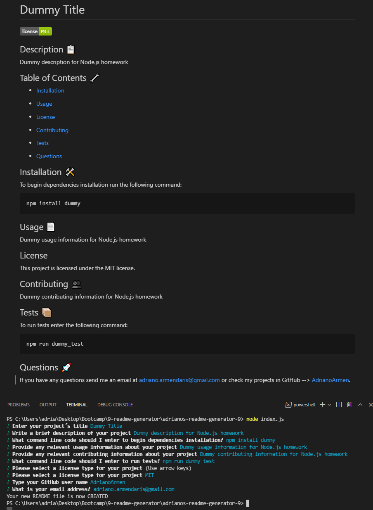

# adrianos-readme-generatos-9

Homework 9 - Readme Generator

## GitHub Repository 🚀

- [GitHub Repo Link](https://github.com/AdrianoArmen/adrianos-readme-generator-9)

## Example Result 📦

- [Generated dummy README file from test](GENERATED_README_EXAMPLE\README.md)

## Walkthrough Video 📺

- [Video Link](https://www.loom.com/share/5eb1b87516d3450a9e612bcffcb2f2e4)

## Project Description 📋

This command-line application powered by [Node.js](https://nodejs.org/es/) was buit to showcase my experience with [NPM](https://www.npmjs.com/) and the[Inquirer package](https://www.npmjs.com/package/inquirer). Following the acceptance criteria guidelines, the **index.js** file contains an array with the inquirer questions and input fields required to generate the final file. The [File System module](https://nodejs.org/api/fs.html) was used to allocate the new file on the directory path. After running the command-line instructions you will create a professional README file with your own custom data.

## Dummy README 🔧

- The following screen capture demonstrated a Dummy README file generated by the command-line application:

---



**_Note_**: If you have an existing README file on the root directory after running **node index.js** that file will be replaced with the brand new generated README. Therefore If you clone this repository the instructions will be replaced by the generated file after running the command-line application.

---

## Run your Generator with Node.js 💾

1. The application will be invoked by using the following command:

```bash
node index.js
```

2. After you run that command line a quick questionare will be prompted asking you to fill your projects informarion.

3. When the questionnaire is completed you will see the following console log:

```md
Your new README file is now CREATED
```

4. Your brand new README file will be created on the root directory - Enjoy!

## Technologies used 🛠️

- [Node.js](https://nodejs.org/es/) - command-line enviroment
- [Inquirer.js](https://www.npmjs.com/package/inquirer) - inquiry session flow
- [File System module](https://nodejs.org/api/fs.html) - directory navigation
- [NPM](https://www.npmjs.com/) - package manager

## License 📄

This project is licensed under the MIT License - see the [LICENSE.md](LICENSE.md) file for details

---

© 2021 Adriano.
